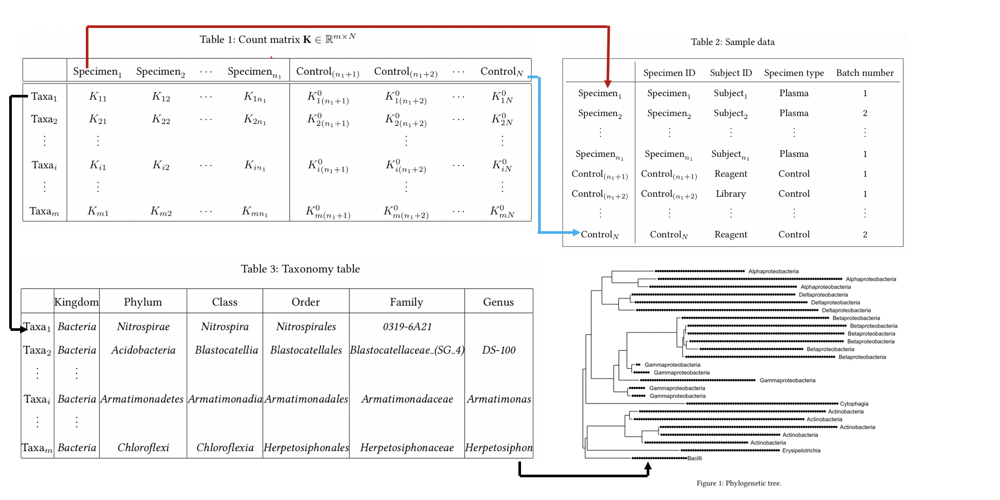

```{r setup, include=FALSE}
knitr::opts_chunk$set(
  echo = TRUE,
  fig.width = 9,
  message=FALSE, 
  warning=FALSE)

```


## Outline


## Motivation (1 slide)

- State the problem?
- Why does this problem important?
- Any solution already exists for the problem?
- Goal of this project?
- etc.?


## Data (1 slide)

- Source? 
- Is it a data frame? 
  - What is in rows? 
  - What is in columns?
- Results of exploratory analysis?
  - Data types, type of response if any?
  - Correlation analysis?
  - Outliers?
  - Missingness?
  - Data transformation, etc. ?
- $n>p$ or $n<p$ or $n \approx  p$? 
- etc. ?

## Data (Example)


```{r fig.align='center', out.width="100%", echo=FALSE, fig.cap="Source:xxx."}

```

$K_{ij}$ abundance of $i$-taxon in $j$-th sample.

## Methods (1 slide)
- What are the two methods you compared? 
- Why those two methods?
- Algorithms of the methods? 
- Any statistical transformation used?
- Any other pre-processing (feature engineering) used?
- Any feature selection (filter, or wrapper, or embedded) used? 
- etc.?

## Methods (Example)^[An introduction to statistical learning [@james2013introduction]]
* KNN and DT for classification.
* Decision trees - partition the predictor space into simple regions.
  * Predict $y_{0}$ of a new data point $x_{0}$ using the response of training observations in the region to which $x_{0}$ belongs. 
  * How to find the partitions?
* KNN - 

## Results (1 slide)
- What are the results of applying the methods? 
  - Visualize the results? 
  - Compare the methods using graphs?
  - Interpret the model/results?
  - etc.?

## Discussion (1 slide)

- Discuss problems related to the methods and data - 
  - Curse of dimensionality? 
  - Multiple data types? 
  - Interpretablity? 
  - Reproducibility? 
  - Stability?
  - etc. ?


##

  \begin{center}
			\textbf{{\LARGE Thank You!}}
		\end{center}
		


## References 


